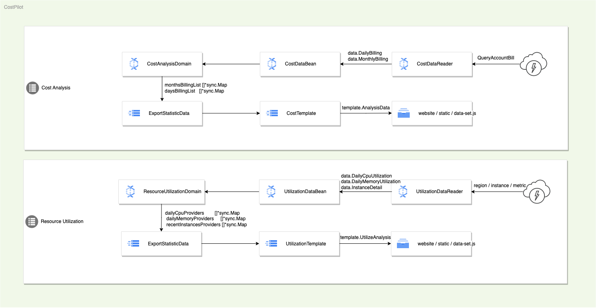

# CostPilot

语言(language)
----

中文 | [English](https://github.com/galaxy-future/costpilot/blob/dev/README.md)

简介
-----
CostPilot 是星汉未来基于先进的 FinOps 理念开发的一站式全场景云上 IT 成本管理平台， 通过对成本的深入洞察，快速生成成本报告，并从多种角度提供专业的成本优化建议， 以及一体化的优化功能，助力企业 IT 成本优化高达 50%。

上手指南
----
#### 1. 配置要求
- 为了软件稳定运行，建议系统型号2核4G内存；CostPilot 已经在 Linux 系统以及 MacOS 系统进行了运行和测试。
- 运行中使用的 AK/SK 需具备对应云账户的账单(费用)读取权限。

#### 2. 通过源代码执行
通过源代码执行 CostPilot 分析, 需确保已安装 Git ( [Git - Downloads](https://git-scm.com/downloads)) 和 Go (**1.17版本及以上**) 并完成对应环境配置.
* (1) 下载源代码
    ```shell
    git clone https://github.com/galaxy-future/costpilot.git
    ```
* (2) 通过环境变量的方式运行 (此方式仅支持并行分析一个云账户)
    - 注意把 'abc' 替换为自己云账号的 ak/sk
  ```shell
  COSTPILOT_PROVIDER=AlibabaCloud COSTPILOT_AK=abc COSTPILOT_SK=abc COSTPILOT_REGION_ID=cn-beijing go run .
  ```
* (3) 通过配置文件的方式运行 (此方式支持并行分析多个云账户)
    -  编辑 conf/config.yaml 配置文件 (目前仅支持 provider: AlibabaCloud).
     ```yaml
        cloud_accounts:
          - provider:  # required :AlibabaCloud
            ak:  # required
            sk:  # required
            region_id:  # required
            name:  # not required
    ```
    - make 指令触发执行
        ```shell
        make build && make run
      ```
    - 分析完成后, 在浏览器中打开 website/index.html 查看分析结果.

#### 3. 通过 Docker 执行
通过 docker 执行 CostPilot 分析, 需确保已安装 Docker (参考
[Docker Engine Install](https://docs.docker.com/engine/install/)).

* (1) 通过环境变量的方式运行 (此方式仅支持并行分析一个云账户)
    - 注意把 'abc' 替换为自己云账号的 ak/sk
      ```shell
      docker run --env COSTPILOT_PROVIDER=AlibabaCloud --env COSTPILOT_AK=abc --env COSTPILOT_SK=abc --env COSTPILOT_REGION_ID=cn-beijing -p 8504:8504 --name=costpilot galaxy-future/costpilot
      ```
* (2) 通过配置文件的方式运行 (此方式支持并行分析多个云账户)
    - 创建一个新的 config.yaml (填写完配置), 执行下面的 docker 命令(注意替换 '/tmp/config.yaml' 为真实的 config.yaml
      绝对路径)
      ```shell
      docker run --mount type=bind,source=/tmp/config.yaml,target=/home/tiger/app/conf/config.yaml -p 8504:8504 --name=costpilot galaxy-future/costpilot
      ```

#### 4. 效果展示


#### 5. 数据流图



行为准则
------
[贡献者公约](https://github.com/galaxy-future/costpilot/blob/dev/CODE_OF_CONDUCT)

授权
-----

CostPilot uses [Apache License 2.0](https://github.com/galaxy-future/costpilot/blob/dev/LICENSE) licensing agreement for
authorization

联系我们
-----

[Weibo](https://weibo.com/galaxyfuture) | [Zhihu](https://www.zhihu.com/org/xing-yi-wei-lai) | [Bilibili](https://space.bilibili.com/2057006251)
| [WeChat Official Account](https://github.com/galaxy-future/comandx/blob/main/docs/resource/wechat_official_account.md)

扫描下方二维码添加官方助手，入群了解更多开源信息：


